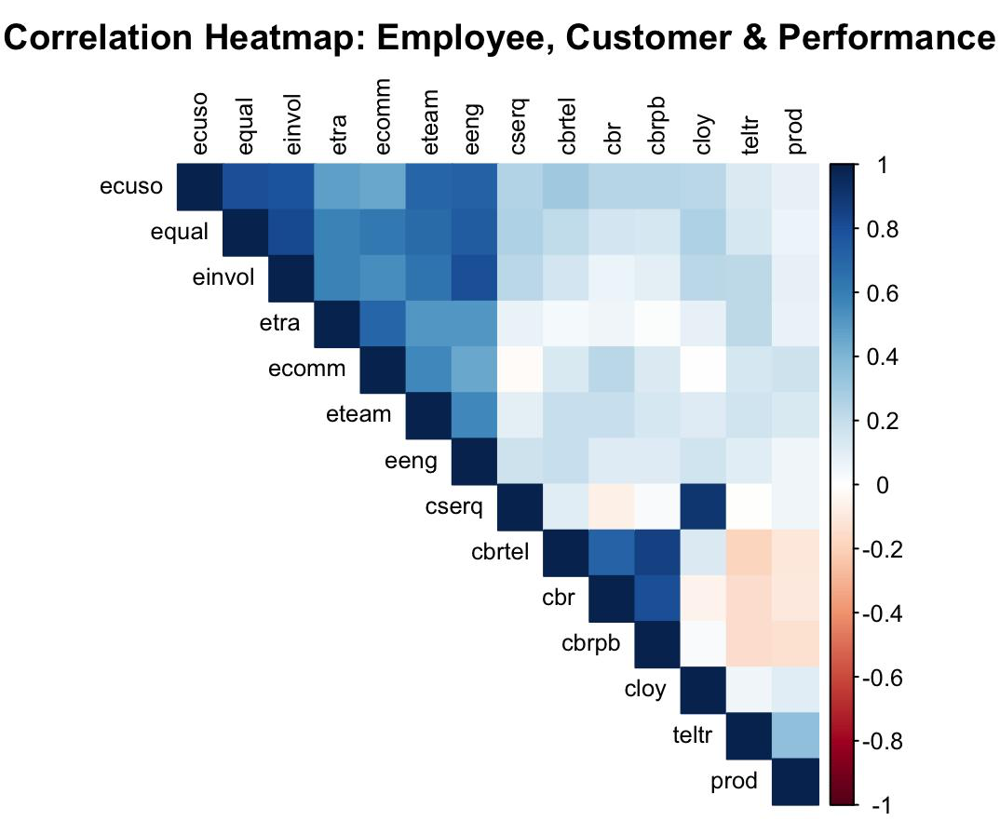

# kenexa-ncb-employee-engagement-analysis
Capstone project: employee engagement vs customer satisfaction vs branch performance (R, regression, clustering, Shiny)
# Employee Engagement & Customer Satisfaction Analytics (Banking)

---

## 📊 Dashboard Preview

---

## 📄 Presentation
[View the Capstone Presentation](report/capstone-presentation.pptx)

---

## 📁 Repository Structure
- `scripts/` → R code for analysis and modeling
- `data/` → (optional) anonymized or mock data only
- `plots/` → dashboard and results images
- `report/` → presentation/report files

## 📊 Key Findings

- Employee engagement significantly impacts service quality.
- Service quality is the strongest predictor of customer loyalty (R² ≈ 0.81).
- K-means clustering segmented 128 branches into high, medium, and low performance groups.
- PCA was used to reduce dimensionality and identify major engagement drivers.

1. Clone the repository:
2. Place a mock or anonymized dataset in the `data/` folder named `mock_kenexa_data.csv`.
3. Open the R scripts in RStudio.
4. Run the scripts in order from the `scripts/` folder.
